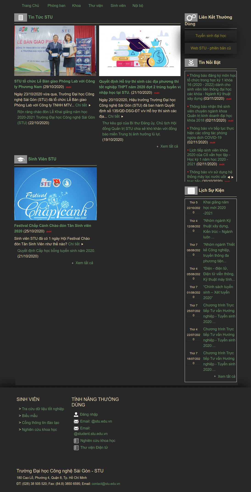
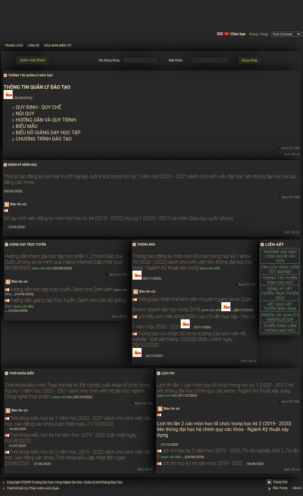

# STU dark theme

Reach out to [Thuan Pham](https://github.com/thuanpham2311) or go to [Discussion](https://github.com/dsc-stu/dsc-stu/discussions) if you have any questions!

<table>
    <tr>
        <td>
        <a href="https://www.facebook.com/dscstu/"><p>📰 Facebook</p></a>
        <a href="https://www.youtube.com/channel/UCjjkz2HwC-Ud6_o8fdD3isA/"><p>▶️ Youtube</p></a>
        <a href="https://discord.gg/p92uD3F4He"><p>💬 Chat</p></a>
        <a href="https://github.com/dsc-stu/dsc-stu/blob/main/promotionalMeterials.md"><p>📢 Promotional Meterials</p></a>
        <a href="https://github.com/dsc-stu/dsc-stu/discussions/categories/q-a"><p>🙏 Q&A</p></a>
        </td>
        <td>
        <a href="https://github.com/orgs/dsc-stu/projects"><p>🎒 Tasks</p></a>
        <a href="https://docs.google.com/spreadsheets/d/1x-_EVnWdRT1esPNLsMF8wJLChpMAu-XFIwa9WhLynso/edit?usp=sharing"><p>💸 Finance & Sponsorships</p></a>
        <a href="https://github.com/dsc-stu/dsc-stu/discussions/3"><p>🙌 Join Us </p></a>
        <a href="https://github.com/dsc-stu/dsc-stu/discussions/categories/ideas"><p>💡 Ideas</p></a>
        <a href="https://docs.google.com/spreadsheets/d/1uYJmHyzVsvtph7GDDy6ORQxkxb-bsLgYk2kd_oRy1D4"><p>☎️ External Contacts</p></a>
        </td>
    </tr>
</table>

## Available on

- [daotao1.stu.edu.vn](http://daotao1.stu.edu.vn)
- [stu.edu.vn](http://stu.edu.vn)

## Review

<div>

&emsp;

</div>

## Install

1. Install [Stylus](https://github.com/stylus/stylus)
2. click icon Stylus > link below "Write style for:"
3. copy and paste css file

## style guide

### Color

```css
--bg: #282828;
--fg: #ebdbb2;
--red: #cc241d;
--green: #98971a;
--yellow: #d79921;
--blue: #458588;
--purple: #b16286;
--aqua: #689d6a;
--gray: #a89984;
```

## Tested

- brave browser

## Contributing workflow

Here’s how we suggest you go about proposing a change to this project:

1. [Fork this project][fork] to your account.
2. [Create a branch][branch] for the change you intend to make.
3. Make your changes to your fork.
4. [Send a pull request][pr] from your fork’s branch to our `master` branch.

[fork]: https://help.github.com/articles/fork-a-repo/
[branch]: https://help.github.com/articles/creating-and-deleting-branches-within-your-repository
[pr]: https://help.github.com/articles/using-pull-requests/
